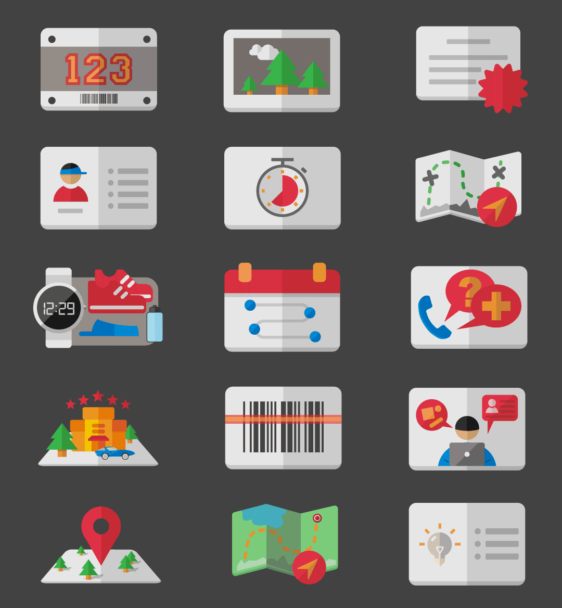

# A multicolor icon set for Raceon

一个赛事图标集

# 使用授权
Copyright (c) 2018, 玩赛小助手
任何人/机构在遵守以下条件的前提下，可使用、修改、再次发布本软件或以源代码及二进
制形式使用软件：

* 源代码的再发布必须遵守上述版权通知、本条件列表以及以下免责声明。
* 以二进制形式使用、再发布此软件或衍生软件时必须复制上述版权通知、本条款列表以
	及文档下文中的免责声明和/或发布代码时提供的其他信息。并在使用中呈现准确呈现文
	案：“来自 玩赛小助手“ 或者 ”from 玩赛小助手“
* 未经事先书面批准的情况下，不得将“玩赛小助手”或作者名用于支持或推广该软件的衍生产品。

本软件为版权所有人和贡献者“按现状”为根据提供，不提供任何明确或暗示的保证，包括但
不限于本软件针对特定用途的可售性及适用性的暗示保证。在任何情况下，版权所有人或其贡
献者均不对因使用本软件而以任何方式产生的任何直接、间接、偶然、特殊、典型或因此而生
的损失（包括但不限于采购替换产品或服务；使用价值、数据或利润的损失；或业务中断）而
根据任何责任理论，包括合同、严格责任或侵权行为（包括疏忽或其他）承担任何责任，即使
在已经提醒可能发生此类损失的情况下。
